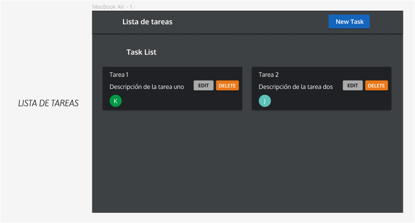
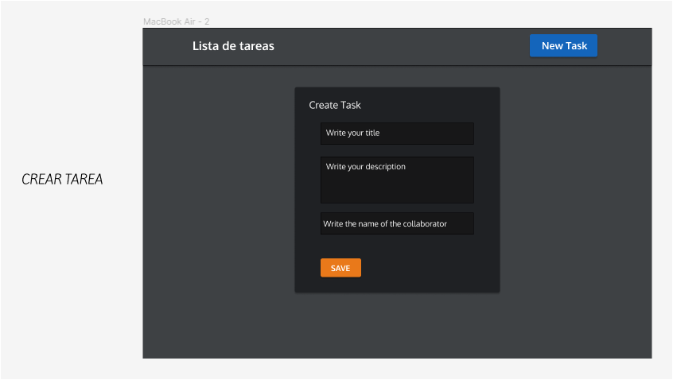

# Lab Notes

## Índice

* [1. Preámbulo](#1-preámbulo)
* [2. Resumen del Proyecto](#2-resumen-del-proyecto)
* [3. Objetivos de Aprendizaje](#3-objetivos-de-aprendizaje)
* [4. Prototipo](#4-prototipo)
* [5. Historias de usuario](#5-historias-de-usuario)
* [6. Consideraciones técnicas](#6-consideraciones-técnicas)
* [7. Hacker Edition](#7-hacker-edition)
* [8. Recursos](#8-recursos)

***

## 1. Preámbulo

Hoy en día no es práctico imaginar el desarrollo web sin HTML, CSS y JavaScript,
esta última es el alma del desarrollo de aplicaciones web.
[React](https://reactjs.org/), [Angular](https://angular.io/) y [Vue](https://vuejs.org/)
son algunos de los _frameworks_ y _librerías_ de JavaScript más utilizados por
lxs desarrolladorxs alrededor del mundo, y hay una razón para eso.
En el contexto del navegador, [_mantener la interfaz sincronizada con el estado
es difícil_](https://medium.com/dailyjs/the-deepest-reason-why-modern-javascript-frameworks-exist-933b86ebc445).
Al elegir un _framework_ o _librería_ para nuestra interfaz, nos apoyamos en una
serie de convenciones e implementaciones _probadas_ y _documentadas_ para
resolver un problema común a toda interfaz web. Esto nos permite concentrarnos
mejor (dedicar más tiempo) en las características _específicas_ de
nuestra aplicación.

Cuando elegimos una de estas tecnologías no solo importamos un pedacito de
código para reusar (lo cual es un gran valor per se), si no que adoptamos una
**arquitectura**, una serie de **principios de diseño**, un **paradigma**, unas
**abstracciones**, un **vocabulario**, una **comunidad**, etc.

Como desarrolladora front-end, estos kits de desarrollo pueden resultarte
de gran ayuda para implementar rápidamente características de los proyectos en
los que trabajes.

## 2. Resumen del Proyecto

En este proyecto construiremos una aplicación para tomar notas, que nos permita
crear, editar, eliminar y consultarlas en cualquier momento.

No existe día que no tomemos notas, siempre necesitamos apuntar alguna
dirección, número telefónico, notas de alguna reunión o guardar nuestras URLs
favoritas para poder consultarlas más tarde. Muchas veces para esta actividad
utilizamos libretas o agendas que terminan siendo olvidadas, o anotamos de
manera dispersa de tal manera que perdemos de vista la prioridad y el propósito
de la nota lo cual da como resultado una nota perdida.

El objetivo principal de este proyecto es aprender a construir una _interfaz
web_ usando el _framework_ elegido. Todos estos frameworks de Frontend atacan el
mismo problema: **cómo mantener la interfaz y el estado sincronizados**. Así que
esta experiencia espera familiarizarte con el concepto de _estado de pantalla_,
y cómo cada cambio sobre el estado se va a ir reflejando en la interfaz (por
ejemplo, cada vez que agregamos una _nota_, la interfaz debe actualizar la lista
de notas).

## 3. Objetivos de Aprendizaje

> ℹ️ Esta sección será automáticamente generada en el idioma pertinente, a partir
> de los objetivos de aprendizaje declarados en [`project.yml`](./project.yml),
> al crear el repo del proyecto para un cohort en particular usando
> [`./scripts/create-cohort-project.js`](../../scripts#create-cohort-project-coaches).
>
> Acá puedes ver una [lista de todos los objetivos de aprendizaje](../../learning-objectives/data.yml)
> que contempla nuestra currícula.

## 4. Prototipo

Para desarrollar el proyecto realizamos diseños de alta fidelidad usando Figma, el cual se puede revisar en el siguiente [Figma](https://www.figma.com/file/I6bhQnK3Dk7zXeNVDiOKz6/Labo-Note-Project?type=design&node-id=0-1&mode=design&t=uESlwi9sP2jO439p-0)

🌱 Vista de lista de tareas

🌱 Vista para crear tareas

## 5. Historias de usuario

### Definición del producto

La [_Product Owner_](https://youtu.be/r2hU7MVIzxs) nos presenta este _backlog_
que es el resultado de su trabajo colaborativo.

***

### Historias de usuaria

#### [Historia de usuaria 1] Debería poder crear cuenta, iniciar y cerrar sesión

Yo como usuaria debo poder crear una cuenta y autenticarme usando login de
Google para acceder a mis notas.

***

#### [Historia de usuaria 2] Debería poder tomar nota

Yo como usuaria quiero tomar nota para no depender de mi mala
memoria y tener presente en todo momento los apuntes ó cosas importantes que
antes escribía en papel.

***

#### [Historia de usuaria 3] Debería poder ver las notas

Yo como usuaria quiero leer mis notas para recordar lo que escribí
antes.

***

#### [Historia de usuaria 4] Debería poder editar las notas

Yo como usuaria quiero editar notas para poder modificar lo que
escribí antes.

***

#### [Historia de usuaria 5] Debería poder borrar notas

Yo como usuaria quiero borrar una nota para no volver a verla.

***

##### Criterios de aceptación

Lo que debe ocurrir para que se satisfagan las necesidades del usuario

* Anotar un título a mi nota
* Agregar el contenido de mi nota.
* Ver todas mis notas.
* Ver la última modificación de la nota.
* Modificar las notas.
* Eliminar notas.
* Se ve y funciona bien en una _Tablet_

##### Definición de terminado

Lo acordado que debe ocurrir para decir que la historia está terminada.

* Debes haber recibido _code review_ de al menos una compañera.
* Haces _test_ unitarios y, además, has testeado tu producto manualmente.
* Desplegaste tu aplicación y has etiquetado tu versión ([`git tag`](https://youtu.be/5DkX3HFgklM)).

## 6. Consideraciones técnicas

El proyecto deberá contener los siguientes archivos base de configuración,
aunque no serán los únicos archivos que quizás tendrás que crear.

* `README.md` es donde se encontrará la descripción del proyecto y elementos
  relevantes de tu proyecto.
* `.editorconfig` este archivo contiene la configuración para editores de texto.
* `.gitignore`  este archivo contiene reglas para ignorar `node_modules` u otras
  carpetas que no deban incluirse en control de versiones (`git`).
* `.eslintrc` este archivo contiene reglas para formatear el código además de
  ser una buena practica tener configurado un linter.

Para este proyecto necesitas crear una Web App con **una librería o
framework de JavaScript** (`React`, `Angular` o `Vue`) y **Firebase**.

Para este proyecto tendrás que manejar _vistas_. Esto significa que cada sección
tendrá su propia URL, la cual indica que _vista_ o _componente_ será mostrado en
pantalla. Para ello necesitaremos investigar acerca de _la API para el manejo de
rutas (en la librería o framework que elijas)_ y el concepto de _Single Page
Application_.

## 7. Hacker Edition

Una vez que hayas terminado las funcionalidades base del proyecto, puedes
pasarte a esta sección.

* Si la usuaria empieza a escribir una nota y por alguna razón la pestaña del
  navegador se cierra, cuando la vuelva a abrir, la nota debería mostrarse como
  estaba.
* Subir imágenes.
* Ver el número de veces que he editado mi nota.
* Consumo de API/s (Google Maps, Spotify, Pinterest, etc.)
* Progressive Web App (PWA).
* Puedes crear categorías y clasificar por tipo de nota.
* Guardar el color de la nota.
* Crear una nota como publica.

## 8. Recursos

Súmate al canal de Slack
[#project-lab-notes](https://claseslaboratoria.slack.com/archives/C03SBNSE7HQ)
para conversar y pedir ayuda del proyecto.

### Frameworks / libraries

* [React](https://reactjs.org/)

### Herramientas

* [npm-scripts](https://docs.npmjs.com/misc/scripts)
* [Babel](https://babeljs.io/)
* [webpack](https://webpack.js.org/)

### PWA

* [Tu primera Progressive Web App - Google developers](https://developers.google.com/web/fundamentals/codelabs/your-first-pwapp/?hl=es)
* [Progressive Web Apps - codigofacilito.com](https://codigofacilito.com/articulos/progressive-apps)
* [offlinefirst.org](http://offlinefirst.org/)
* [Usando Service Workers - MDN](https://developer.mozilla.org/es/docs/Web/API/Service_Worker_API/Using_Service_Workers)
* [Cómo habilitar datos sin conexión - Firebase Docs](https://firebase.google.com/docs/firestore/manage-data/enable-offline?hl=es-419)

### Otros recursos

* [Vite - monta tu primer proyecto Vite, recomendación para empezar tu proyecto](https://es.vitejs.dev/guide/#monta-tu-primer-proyecto-vite)
* [npm-scripts](https://docs.npmjs.com/misc/scripts)
* [deploy con gh-pages](https://medium.com/the-andela-way/how-to-deploy-your-react-application-to-github-pages-in-less-than-5-minutes-8c5f665a2d2a)
* [Usando Service Workers - MDN](https://developer.mozilla.org/es/docs/Web/API/Service_Worker_API/Using_Service_Workers)
* [What is a Single Page Application](https://medium.com/@NeotericEU/single-page-application-vs-multiple-page-application-2591588efe58)